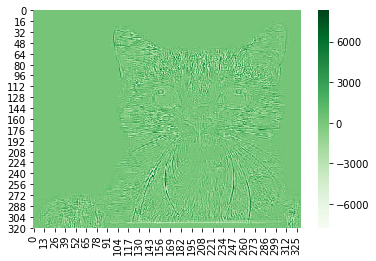

# Classroom activities

**Tip**: When opening .ipynb files if you get **`Sorry,... Reload?`** error in Github, use **[https://nbviewer.jupyter.org/](https://nbviewer.jupyter.org/)**  

--------------  

## Python
* Practice [python.ipynb](python.ipynb)

## Numpy, Matplotlib, & Pandas
* Practice [numpy.ipynb](numpy.ipynb)
* Practice [matploblib.ipynb](matploblib.ipynb)
* Practice [pandas.ipynb](pandas.ipynb)

## Ch18: Univariate linear regression
* Practice [univariate_linear_regression.ipynb](univariate_linear_regression.ipynb)
* Find a dataset of your choice at [kaggle.com](https://kaggle.com/)
* From this dataset, select two variables (one input and one output) and perform univariate linear regression
  - Check that the variables you select are continuous

## Ch18: Linear regression with two input variables
* Practice [Linear_Regression_with_Two_Input_Variables.ipynb](Linear_Regression_with_Two_Input_Variables.ipynb)
* Find a dataset of your choice at [kaggle.com](https://kaggle.com/)
* From this dataset, select three variables (two input and one output) and perform regression
  - Check that the variables you select are continuous

## Ch18: Logistic regression
* Practice [Logistic_Regression_Example.ipynb](Logistic_Regression_Example.ipynb)
* Find a classification dataset of your choice at [kaggle.com](https://kaggle.com/)
* From this dataset, select three variables (two input and one output) and perform regression
  - Check that the output variable is binary

## Discussion: Basics of neural networks
* Group discussion of "[A Visual and Interactive Guide to the Basics of Neural Networks](http://jalammar.github.io/visual-interactive-guide-basics-neural-networks/)"
* Groups ask questions to each other

## Binary classification using NN
* Practice the first part of [Binary_Classification.ipynb](Binary_Classification.ipynb), i.e. only upto `model.fit()`
* Find a classification dataset of your choice at [kaggle.com](https://kaggle.com/)
  - Check that the output variable is binary
* Build a binary NN classifier for your dataset
* Build a logistic regression model and observe the accuracy

## Evaluating a binary classifier
* Practice the second part of [Binary_Classification.ipynb](Binary_Classification.ipynb), i.e. after `model.fit()`
* Evaluate your model on your dataset and discuss which metrics are meaningful and which are not
* What is the baseline accuracy?

## Ch03: Implement Breadth-first search
Implement the Breadth First Search algorithm to find the shortest path from Sibiu to Bucharest.  
 

## Regression using NN


## Ch05: Alpha-beta pruning
For the following game tree, show which nodes/sub-tree will be pruned by the Alpha-Beta pruning algorithm. Assume that the nodes are processed from left to right. Note that this is not a programming homework. You can solve it in paper, take a picture, and submit it at Canvas.  


## Evaluating a regression model


## Overfitting vs generalization

## Learning curves


## Discussion: Evaluating & selecting models


## Ch22: Implement BM25
A search query “Word1 Word2” is being scored against the following documents (see table). The document corpus (as shown in the table) only contains five documents. The number of times the words “Word1” and “Word2” appear in each of the documents is given in the table. The length of each document is also given. Assume k = 1.2 and b = 0.75. Write a (Python preferably) program to calculate the BM25 score for the query against all the documents and rank the documents by their BM25 score. Your program should read the table from a file, i.e. do not hardcode these values into your program. You may hardcode the values of k and b, but compute IDF, DF, TF, N, L, etc. using the data you read from the text file, at runtime. The scores you will obtain will range from -2.3 to -4.8. Note: You may get negative scores because of N being close to DF - you can read more [here](https://en.wikipedia.org/wiki/Okapi_BM25).  


## Ch22: Implement PageRank
Given the number of web pages N = 3, and the damping parameter d = 0.7. For the network shown below, calculate the PageRank of the pages A, B, and C. Links between the pages are shown in the graph itself. Write a program to iteratively obtain the final page ranks. Submit your code and screenshots of output.


## Iterative feature removal & selection
## Ch24: Convolution operation
The task here is to detect edges in an input image. The file `one-channel.csv` is one channel of the cat image we discussed in class. With `one-channel.csv` as input, complete the `convolution2D()` subroutine in the code below to get output shown. You will need to multiply each input pixel (3x3 neighbor grid) of the input 2D array `image2D` with the input filter `kernel3x3` to obtain the output 2D array `convolved2D`. Submit the screenshot of your code and screenshots of your ouptputs.

```python
from google.colab import files
import matplotlib.pyplot as plt
import seaborn as sns

files.upload() # For Google Colab

def convolution2D(image2D, kernel3x3):
  
  
  # Write your code here
  
  
  return convolved2D

image2D = np.loadtxt('one-channel.csv', delimiter=',')
sns.heatmap(image2D, cmap='Greens')
plt.show()

edge_detect_filter_3x3 = np.array([[-1, -1, -1], [-1, 8, -1], [-1, -1, -1]])

# Convolve once
convolved_image = convolution2D(image2D, edge_detect_filter_3x3)

sns.heatmap(convolved_image, cmap='Greens')
plt.show()

# Convolve again
convolved_image = convolution2D(convolved_image, edge_detect_filter_3x3)

sns.heatmap(convolved_image, cmap='Greens')
plt.show()
```
  
  


## Learning with missing values & noisy data
## Binary classification using XGBoost
## Feature importance using XGBoost
## Cross-validation
## Discussion: Present & future of AI
## Discussion: Peer-review of reports


